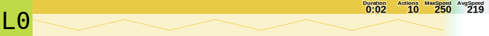
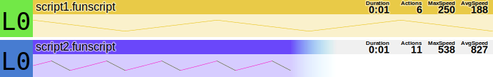
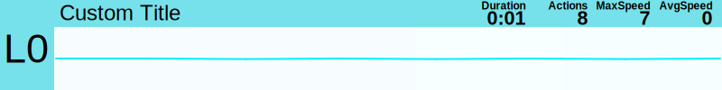
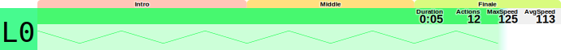
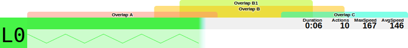
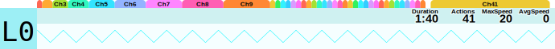

# funlib

[](https://www.npmjs.com/package/@eroscripts/funlib)
[](https://github.com/eroscripts/funlib/blob/main/LICENSE)

A TypeScript library for parsing, creating, manipulating, and visualizing **Funscript** files — the JSON-based format for haptic motion data synchronized with videos.

## Features

- 📦 **Parse & Create** — Read, write, and construct Funscript files with full type safety
- 🎛️ **Multi-Axis Support** — Handle complex multi-axis scripts (stroke, surge, sway, twist, roll, pitch, suck)
- 🔌 **Serial Communication** — TCode protocol support via Web Serial API for direct hardware control
- 📊 **SVG Visualization** — Generate beautiful heatmap-style SVG graphs of scripts
- 🎬 **Video Sync** — Synchronize script playback with HTML5 video elements
- ✂️ **Manipulations** — Smooth, simplify, limit speed, slice chapters, and more
- 🔄 **Format Conversion** — Convert between v1.0, v1.1, and v2.0 formats

## Quick Start

```typescript
import { Funscript } from '@eroscripts/funlib'
import { toSvgBlobUrl } from '@eroscripts/funlib/rendering/svg'

// Create a simple script
const script = new Funscript({
  actions: [
    { at: 0, pos: 0 },
    { at: 500, pos: 100 },
    { at: 1000, pos: 0 },
  ],
  metadata: {
    title: 'My Script',
    duration: 1,
  },
})

// Serialize to prettified JSON
console.log(script.toJsonText())

// Generate SVG visualization
img.src = toSvgBlobUrl(script)
```

## Funscript Format

The library supports three format versions:

### Version 1.0 (Single-Axis)
```json
{
  "version": "1.0",
  "actions": [{ "at": 0, "pos": 50 }],
  "metadata": { "duration": 60 }
}
```

### Version 1.1 (Multi-Axis with axes array)
```json
{
  "version": "1.1",
  "actions": [{ "at": 0, "pos": 50 }],
  "axes": [
    { "id": "R1", "actions": [{ "at": 0, "pos": 50 }] }
  ]
}
```

### Version 2.0 (Multi-Axis with channels object)
```json
{
  "version": "2.0",
  "actions": [{ "at": 0, "pos": 50 }],
  "channels": {
    "roll": { "actions": [{ "at": 0, "pos": 50 }] }
  }
}
```

## Core Classes

### `Funscript`

The main class for working with funscript data.

```typescript
import { Funscript } from '@eroscripts/funlib'

// Parse from JSON
const script = new Funscript(JSON.parse(jsonString))

// Access properties
console.log(script.actions) // FunAction[]
console.log(script.metadata) // FunMetadata
console.log(script.duration) // Duration in seconds
console.log(script.channels) // Multi-axis channels

// Normalize (clamp values, sort, remove duplicates)
script.normalize()

// Clone
const copy = script.clone()

// Export to different versions
script.toJsonText({ version: '1.0' }) // Single-axis format
script.toJsonText({ version: '1.1' }) // Multi-axis with axes array
script.toJsonText({ version: '2.0' }) // Multi-axis with channels object
```

### `FunAction`

Represents a single motion point.

```typescript
import { FunAction } from '@eroscripts/funlib'

const action = new FunAction({ at: 1000, pos: 75 })
console.log(action.at) // 1000 (milliseconds)
console.log(action.pos) // 75 (0-100 position)
```

### Multi-Axis Scripts

Merge multiple single-axis scripts into one multi-axis script:

```typescript
import { Funscript } from '@eroscripts/funlib'

const stroke = new Funscript({ actions: [...a] }, { file: 'video.funscript' })
const roll = new Funscript({ actions: [...a] }, { file: 'video.roll.funscript' })
const pitch = new Funscript({ actions: [...a] }, { file: 'video.pitch.funscript' })

const [merged] = Funscript.mergeMultiAxis([stroke, roll, pitch])

// Access individual channels
merged.channels.roll.actions
merged.channels.pitch.actions

// Access all channels
merged.listChannels // FunChannel[] - array of all channel objects
merged.allChannels // Funscript[] - array including main script and all channels
```

## SVG Visualization

Generate beautiful heatmap visualizations of scripts:

```typescript
import { Funscript } from '@eroscripts/funlib'
import { toSvgBlobUrl, toSvgElement } from '@eroscripts/funlib/rendering/svg'

const script = new Funscript({ actions: [...a] })

// Generate SVG string
const svg = toSvgElement(script, {
  width: 690,
  height: 52,
  title: 'My Script',
  lineWidth: 0.5,
})

// Or get a blob URL for download/display
const blobUrl = toSvgBlobUrl(script, {})
```

### SVG Options

| Option | Type | Default | Description |
|--------|------|---------|-------------|
| `width` | number | 690 | Total width in pixels |
| `height` | number | 52 | Height per axis |
| `lineWidth` | number | 0.5 | Stroke width of motion lines |
| `title` | string \| function \| null | null | Header text |
| `icon` | string \| function \| null | null | Left icon text (axis name) |
| `font` | string | 'Arial, sans-serif' | Font for text |
| `halo` | boolean | true | White outline around text |
| `graphOpacity` | number | 0.2 | Background heatmap opacity |
| `titleOpacity` | number | 0.7 | Title bar opacity |
| `normalize` | boolean | true | Normalize before rendering |

## Snapshot Gallery

Examples from the SVG rendering tests.







## Serial Communication (TCode)

Control TCode-compatible devices via Web Serial:

```typescript
import { TCodeSerialPort } from '@eroscripts/funlib/integrations/serialport'

// Request and open port
const port = await TCodeSerialPort.open()

// Device info (auto-detected on open)
console.log(port.device) // Device name
console.log(port.tcodeVersion) // TCode version
console.log(port.limits) // Axis limits

// Send commands
await port.write('L05000') // Raw TCode string
await port.write(['L0', 50]) // [axis, position]
await port.write(['L0', 100, 'I', 500]) // [axis, position, 'I', interval_ms]

// Move helper
await port.move('L0', 75)

// Set axis limits
await port.setLimits('L0', 10, 90)

// Close
await port.close()
```

## Video Synchronization

Sync script playback with an HTML5 video:

```typescript
import { Funscript } from '@eroscripts/funlib'
import { TCodePlayer } from '@eroscripts/funlib/integrations/video'

const video = document.querySelector('video')
const script = new Funscript({ actions: [...a] })

const player = new TCodePlayer(video, script)

// Connect to device
await player.requestPort()

// Start playback sync
player.run()
video.play()

// Stop
player.stop()
```

## Manipulation Utilities

### Interpolation & Search

```typescript
import {
  binaryFindLeftBorder,
  clerpAt,
} from '@eroscripts/funlib/utils/manipulations'

// Get interpolated position at any timestamp
const position = clerpAt(actions, 5000) // Returns 0-100 position at 5000ms

// Find index of action at or before a timestamp (binary search)
const index = binaryFindLeftBorder(actions, 5000)
```

### Speed & Smoothing

```typescript
import {
  handySmooth,
  limitPeakSpeed,
  simplifyLinearCurve,
  smoothCurve,
} from '@eroscripts/funlib/utils/manipulations'

// Optimize for Handy device constraints (max speed: 550, min interval: 60ms)
const optimized = handySmooth(actions)

// Limit maximum speed
const limited = limitPeakSpeed(actions, 550)

// Smooth with moving average
const smoothed = smoothCurve(actions, 50, 3)

// Remove redundant points
const simplified = simplifyLinearCurve(actions, 3)
```

### Analysis

```typescript
import {
  actionsAverageSpeed,
  actionsRequiredMaxSpeed,
  isPeak,
  toStats,
} from '@eroscripts/funlib/utils/manipulations'

const avgSpeed = actionsAverageSpeed(actions)
const maxSpeed = actionsRequiredMaxSpeed(actions)
const stats = toStats(actions, { durationSeconds: 60 })
// { Duration: '1:00', Actions: 120, MaxSpeed: 350, AvgSpeed: 200 }
```

## TCode Utilities

```typescript
import {
  getTCodeAt,
  getTCodeFrom,
  tcodeTupleToString,
} from '@eroscripts/funlib/utils/tcode'

// Get immediate position commands
const commands = getTCodeAt(script, 5000) // [[axis, pos], ...]

// Get movement commands (with intervals)
const movements = getTCodeFrom(script, 5000, 4900)

// Convert tuple to string
tcodeTupleToString(['L0', 75, 'I', 500]) // "L07500I500"
```

## Conversion Utilities

```typescript
import {
  axisToChannelName,
  channelNameToAxis,
  msToTimeSpan,
  secondsToDuration,
  speedToHex,
  speedToOklch,
  speedToOklchText,
  timeSpanToMs,
} from '@eroscripts/funlib/utils/converter'

timeSpanToMs('00:01:30.500') // 90500
msToTimeSpan(90500) // "00:01:30.500"
secondsToDuration(90.5) // "1:30"

speedToHex(250) // "#e8bd00" (heatmap color)
speedToOklch(250) // [l, c, h, a] array for oklch color
speedToOklchText(250) // "oklch(80% 0.4 106.3)"

channelNameToAxis('roll') // "R1"
axisToChannelName('R1') // "roll"
```

## Axis Reference

| Axis | Channel Name | Description               |
|------|--------------|---------------------------|
| L0   | stroke       | Main linear motion        |
| L1   | surge        | Forward/backward          |
| L2   | sway         | Left/right                |
| R0   | twist        | Rotation around main axis |
| R1   | roll         | Side-to-side tilt         |
| R2   | pitch        | Forward/backward tilt     |
| A1   | suck         | Suction/valve             |

## Browser Usage (IIFE)

For browser environments without a bundler:

```html
<script src="https://unpkg.com/@eroscripts/funlib/dist/iife.js"></script>
<script>
  const script = new Fun.Funscript({ actions: [...] })
  const svg = Fun.svg.toSvgElement(script, {})

  // Serial port
  const port = await Fun.serialport.TCodeSerialPort.open()
</script>
```
